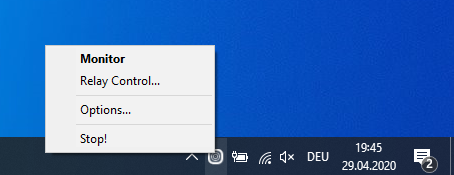
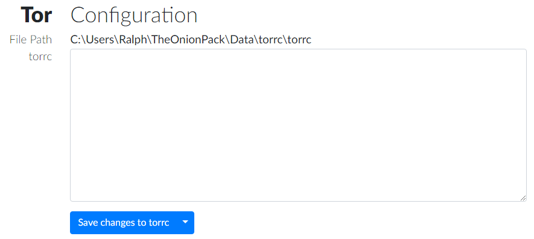
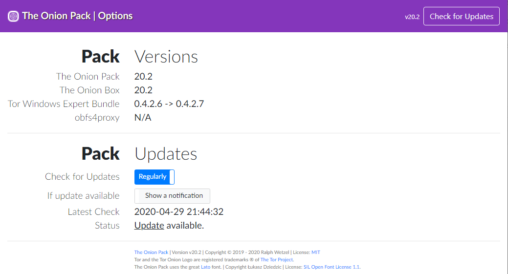

# The Onion Pack
This is The Onion Pack, a **Tor Relay Bundle** for Windows.
It allows you to install everything you need to run a Tor relay (or a Tor bridge) on your Windows computer system & offers you a smart interface to monitor and control your relay.

> **Statement of Independence**  
> This product is produced independently from the Tor(R) anonymity software and
carries no guarantee from [The Tor Project](https://www.torproject.org) about quality, suitability or anything
else.

## Installation
To install The Onion Pack on your Windows computer, download & run [TheOnionPack.exe](https://github.com/ralphwetzel/theonionpack/releases/latest), its installation program.

This installation program is going to perform a number of tasks:

* Locate, download & install the latest Tor *Windows Expert Bundle* from the official sources at [torproject.org](https://www.torproject.org/download/tor/).
* Install - on request - [obfs4proxy](https://github.com/Yawning/obfs4), the latest Tor traffic obfuscator. Currently `obfs4proxy v0.0.11` is bundled into this release of The Onion Pack.
* Download & install a version of *Embeddable Python* from the official sources at [python.org](https://www.python.org/downloads/windows/).
* Setup an appropriate Python environment.
* Download & install [The Onion Box](http://www.theonionbox.com) (Dashboard to monitor Tor node operations) from the [Python Package Index](https://pypi.org/project/theonionbox/).

and finally

* Install The Onion Pack - a python script to control the Tor relay as well as The Onion Box.

## Additional Activities to be performed prior Operation
There's - usually - one additional activity necessary to finish the setup of The Onion Pack & your new personal Tor relay: You need to tell your router / firewall to forward at least one port to your local Windows system:

Tor - if operated as a relay or bridge - expects that clients can connect to its *ORPort*. If this port is not reachable from the voids of the internet, the relay will not announce it's presence - thus will not be of any use. Therefore you have to ensure that connections can be established to this *ORPort*.

The default value for the *ORPort* of any Tor relay is **9001**. You may alter this via *torrc*.

## Operation
When you run The Onion Pack, it launches your Tor relay - setup according to the configuration you defined - and The Onion Box. If both actions have been performed successfully, The Onion Pack puts an icon into the tray of your desktop.


This icon provides a context menu ... to monitor your Tor relay, to control it & to define some optional parameters for The Onion Pack:





| Tray Menu Command | Action |
|---|---|
| **Monitor** | Open The Onion Box, the dashboard to monitor your relay. **Default (right click) action**.
| Relay Control... | Opens a web interface to control your relay: To edit *torrc* (the configuration file of your relay), to re-start your relay or re-load it's configuration & to check its log messages.
| Options... | Opens a web interface to alter some optional aspects of The Onion Pack. This is where you can check the version numbers of the components installed ... and to define the update behaviour of The Onion Pack.
| Stop! | Terminate The Onion Pack

## First Steps
By intension the Tor instance **initially** installed by The Onion Pack is **not operating in relay mode** - yet as a Tor client.  
If you deliberately decide to establish a relay, edit the configuration file: **Tray menu > Relay Control**  
This will open the Relay Control page. The first section of this page provides an editor to manipulate your *torrc*.

<p align="center"></p>

Prerequisite to become a relay is the definition of an [*ORPort*](https://2019.www.torproject.org/docs/tor-manual.html.en#ORPort) :
```
ORPort 9001
```
> Remember to define the port number in accordance to your port forwarding settings established at your router!

Additionally you should at least give a name to your relay and define the [*ContactInfo*](https://2019.www.torproject.org/docs/tor-manual.html.en#ContactInfo) parameter.

```
ORPort 9001
Nickname myRelay
ContactInfo mail at mymail dot com
```

As it is explicitely discouraged to run an Exit Relay on any computer system at home, you should - equally explicit - express your request to disable the exit functionality:

```
ORPort 9001
Nickname myRelay
ContactInfo mail at mymail dot com
ExitRelay 0
```

> Please make yourself familiar with the official documentation at [torproject.org](https://www.torproject.org), especially the [Tor Manual](https://2019.www.torproject.org/docs/tor-manual.html.en), to understand the capabilities of a Tor relay and the power of all its configuration parameters!

You may & should define further configuration parameters ... and if done, <span style="color: blue">`Save changes to torrc`</span>.

To enable this configuration, you need to tell your Tor node to reload it's configuration file. You may do this with the control buttons in section `Tor|Control`:

<p align="center"></p>


Afterwards you may either check the logfile of your relay @ section `Tor|Log` or open the dashboard to monitor your relay: **Tray menu > Monitor**

> By default - in the sense of 'if not explicitely configured to behave differently' - a Tor instance emits log messages of level notice to stdout, a console window. Those messages are displayed in section `Tor|Log`.

## Options

**Tray menu > Options...** allows you to alter the mode of operation of your Onion Pack.

<p align="center"></p>


Section `Pack|Versions` displays the version numbers of the four software packages managed by The Onion Pack.

Section `Pack|Updates` lets you define, if The Onion Pack shall search for updates *Never* or *Regularly*. If an opportunity for an update was found, The Onion Pack may either just *Show a notification* or download the installer and *Perform the update*.

You may as well trigger a `Check for Updates` manually.

Have fun!


## Thank you
I'd like to express my humble respect to @jordanrussel and @martjinlaan for their dedication to [Inno Setup](http://www.jrsoftware.org/isinfo.php). This is an amazing piece of software providing endless opportunities to create powerfull installers. Thanks a lot for your efforts to maintain this gem in code over years, offering it's brilliant capabilities to the community.